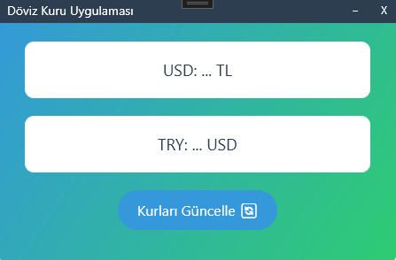

# Döviz Kuru WPF Uygulaması

Bu, C# ve WPF kullanılarak geliştirilmiş bir döviz kuru uygulamasıdır. Türkiye Cumhuriyet Merkez Bankası'ndan (TCMB) anlık USD/TRY kurlarını çeker ve modern bir arayüzle gösterir.

## Özellikler
- USD'nin TL karşılığını gösterir.
- 1 TL'nin USD karşılığını gösterir.
- Özel başlık çubuğu: Sürükleme, küçültme ve kapatma butonları.
- Modern tasarım: Gradient arka plan, yuvarlak kenarlı butonlar, hover efektleri.
- TCMB XML API ile gerçek zamanlı veri çekme.

## Ekran Görüntüsü

## Kurulum
1. Depoyu klonlayın: `git clone https://github.com/BatuSixie/DovizKuruWpf.git`
2. Visual Studio 2022'de projeyi açın.
4. Projeyi çalıştırın (`F5`).

## Teknolojiler
- WPF (.NET 8.0)
- C#
- XAML
- TCMB XML API

## Güncellemeler
- **19 Haziran 2025**: Özel başlık çubuğu düzenlendi, beyaz çizgi sorunu düzeltildi.